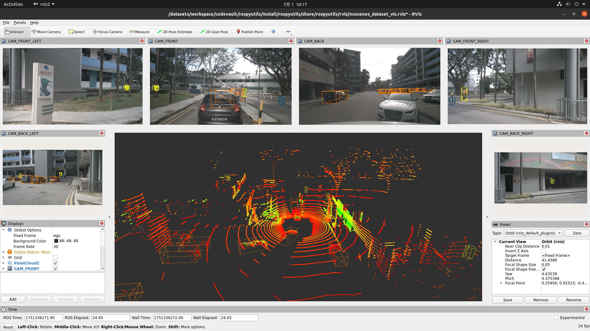
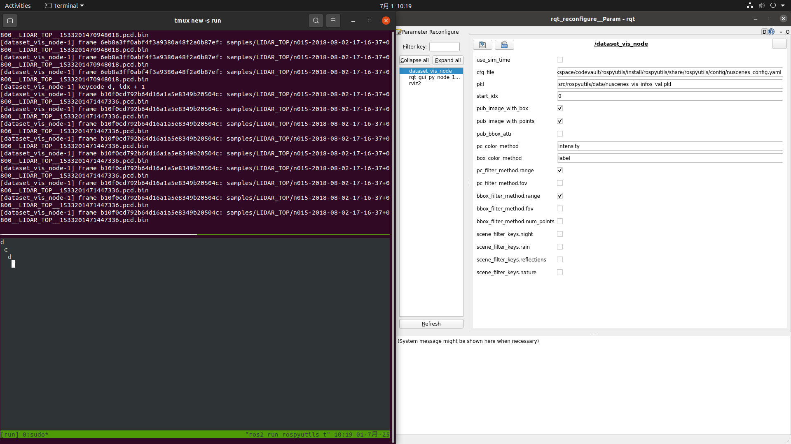

# rospyutils

   

city945 的 rospy 工具包，主要功能包括：数据集可视化

### 快速演示

#### nuScenes 数据集可视化

|  |  |
| :--------------------------------------------: | :------------------------------------------------------: |
|         支持可视化点云、图片、真值框等         |             支持按键播放、动态调整可视化参数             |

### 安装

参考 [INSTALL.md](docs/INSTALL.md)

### 快速入门

```bash
# 创建数据集可视化信息文件
python3 tools/create_vis_infos.py --dataset nuscenes --codebase pcdet --data_root /workspace/codevault/Det3D/OpenPCDet/data/nuscenes/v1.0-trainval

# NuScenes 数据集可视化
colcon build
source install/local_setup.zsh
ros2 launch rospyutils nuscenes_dataset_vis.launch.py pkl:=/path/to/nuscenes_vis_infos_val.pkl
ros2 run rospyutils teleop_key_node
```

- 关于配置文件：`xxx_config.yaml` 中存放常规的配置参数如数据集路径、可视化哪些类别等，`xxx_param.yaml` 中存放 ROS 动态参数的初值配置如是否发布图片等支持动态调整的参数

### 注意事项

- 关于版本控制：由于是个人开发项目，会经常使用 `git rebase` 变基提交和强制推送以保持代码提交历史的简洁
- `colcon build` 会将源代码打包成库放在 `install` 目录下，`config` `rviz` `launch` 等目录下的文件也会拷贝到 `install` 目录下，故代码运行时修改的文件是 `install` 目录下的文件，调试时断点也要打在 `install` 目录下的代码文件中

### 许可证

本代码采用 [GPL-3.0](LICENSE) 许可发布，这意味着你可以自由复制和分发软件，无论个人使用还是商业用途，但修改后的源码不可闭源且必须以相同的许可证发布
