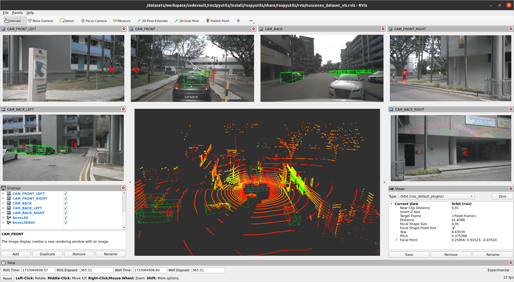
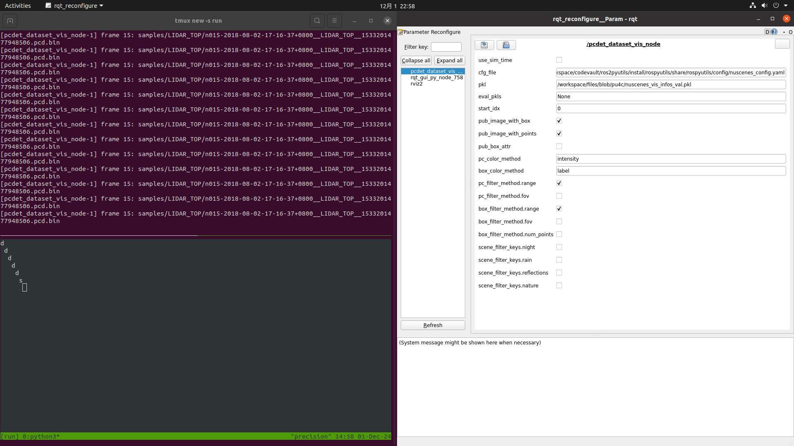

<!-- README.md 模板来源: https://github.com/shaojintian/Best_README_template -->
<!-- Docker Overview 模板来源: https://hub.docker.com/r/kasmweb/ubuntu-focal-desktop -->
# rospyutils
<!-- 打开 https://shields.io/badges/git-hub-license 右侧填写信息，复制链接即可 -->


city945 的 rospy 工具包，主要功能包括：数据集可视化

### 快速演示
#### NuScenes 数据集可视化
支持可视化点云、图片、真值框、预测框等，支持按键播放、自动播放，支持动态调整可视化参数



### 安装
参考 [INSTALL.md](docs/INSTALL.md)

### 快速入门
```bash
# 数据文件准备
wget https://gitlab.com/city945/gitstorage/-/raw/main/rospyutils/nuscenes_vis_infos_val.pkl.gz

# NuScenes 数据集可视化
colcon build
source install/local_setup.zsh
ros2 launch rospyutils nuscenes_dataset_vis.launch.py pkl:=/path/to/nuscenes_infos_val.pkl.gz
ros2 run rospyutils teleop_key_node
```

### 注意事项

- 关于版本控制：由于是个人开发项目，会经常使用 `git rebase` 变基提交和强制推送以保持代码提交历史的简洁
- `colcon build` 会将源代码打包成库放在 `install` 目录下，`config` `rviz` `launch` 等目录下的文件也会拷贝到 `install` 目录下，故代码运行时修改的文件是 `install` 目录下的文件，调试时断点也要打在 `install` 目录下的代码文件中

### 许可证
本代码采用 [GPL-3.0](LICENSE) 许可发布，这意味着你可以自由复制和分发软件，无论个人使用还是商业用途，但修改后的源码不可闭源且必须以相同的许可证发布
